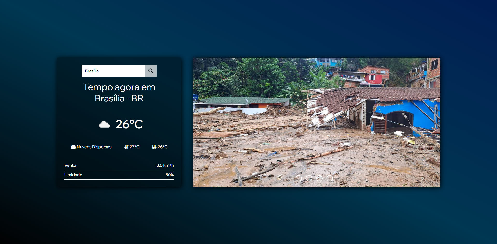
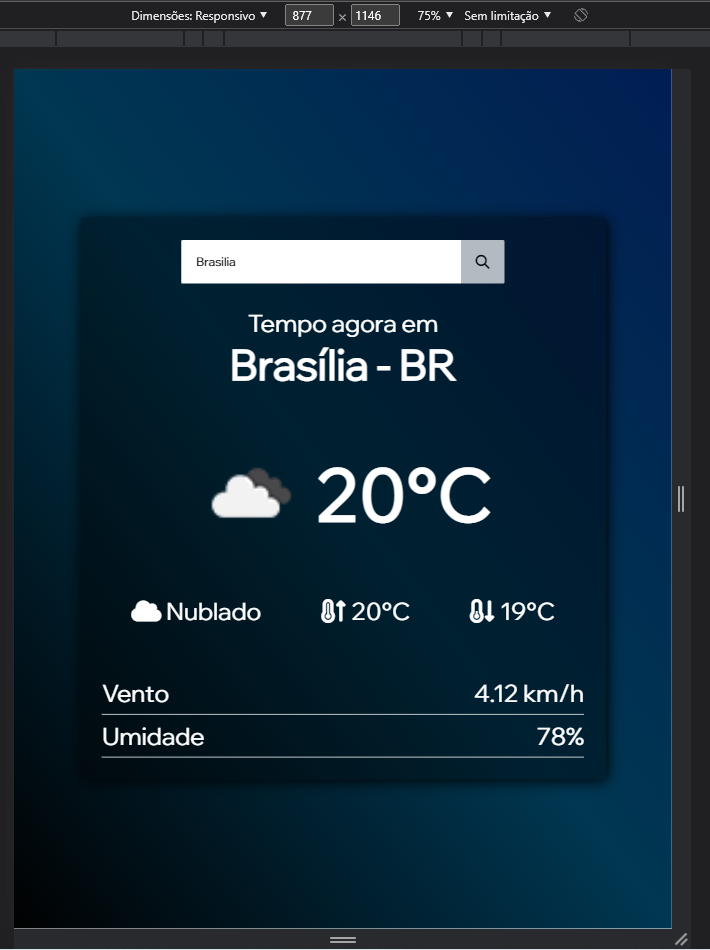
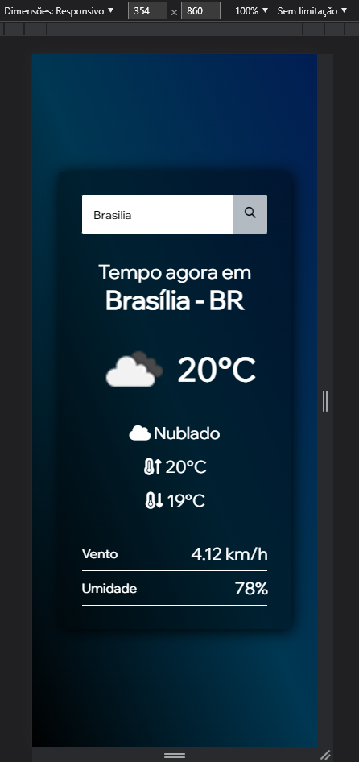

# Importante

Atualmente, uma das principais ferramentas na realização de um projeto inovador são as famosas API's. 
Dito isso, veja abaixo um grande exemplo do que esse serviço é capaz.

# Sobre

No projeto, é informado em tempo real dados climáticos requerindo apenas a localidade desejada. 

# Tecnologias

Além do uso de API, temos HTML, CSS e JS.

# Visualização do projeto

 

 

# Responsividade

  
  

